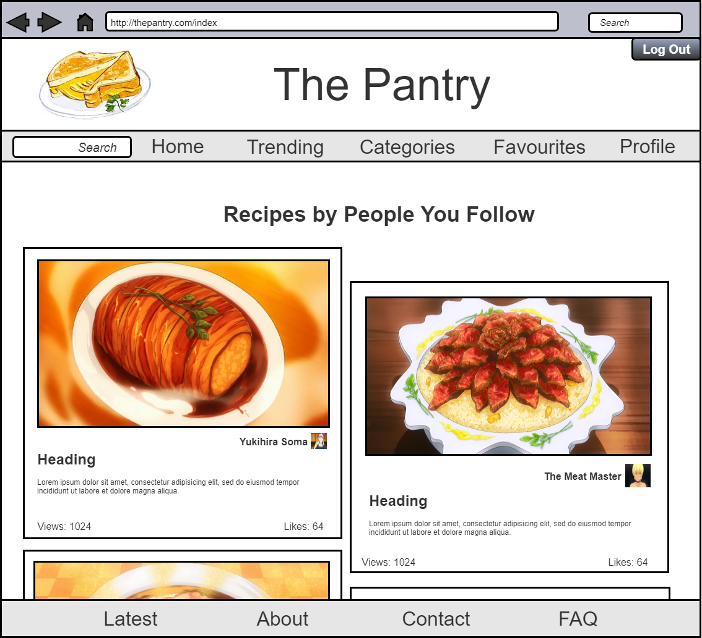
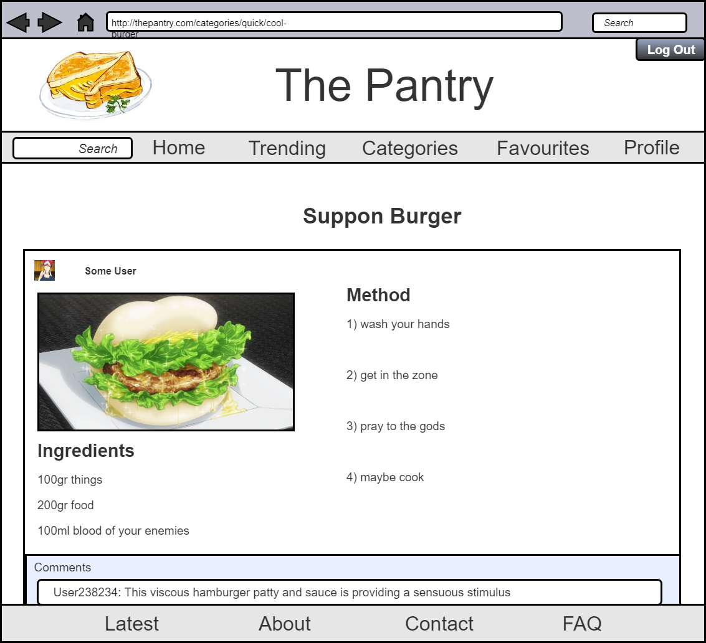
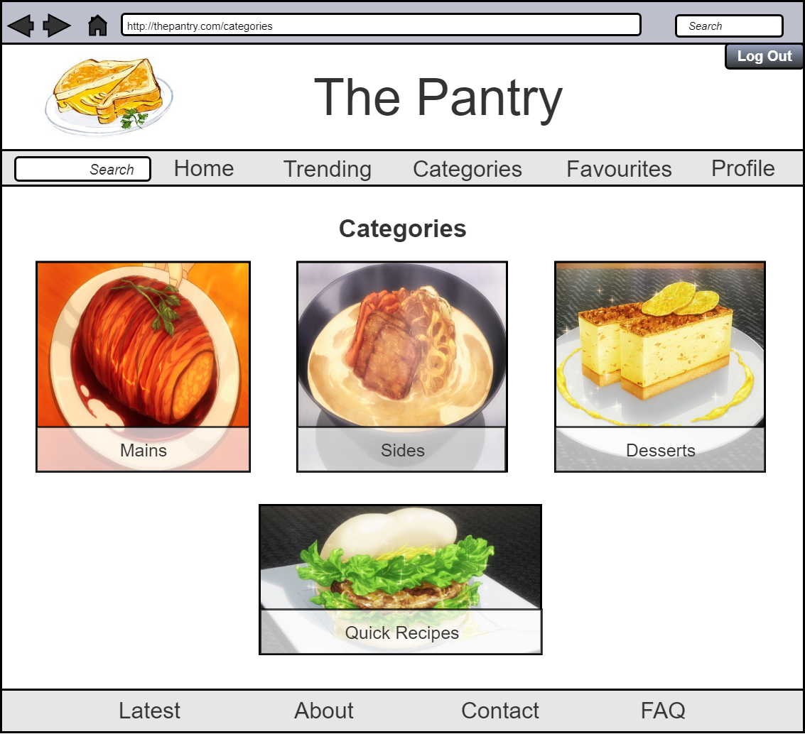
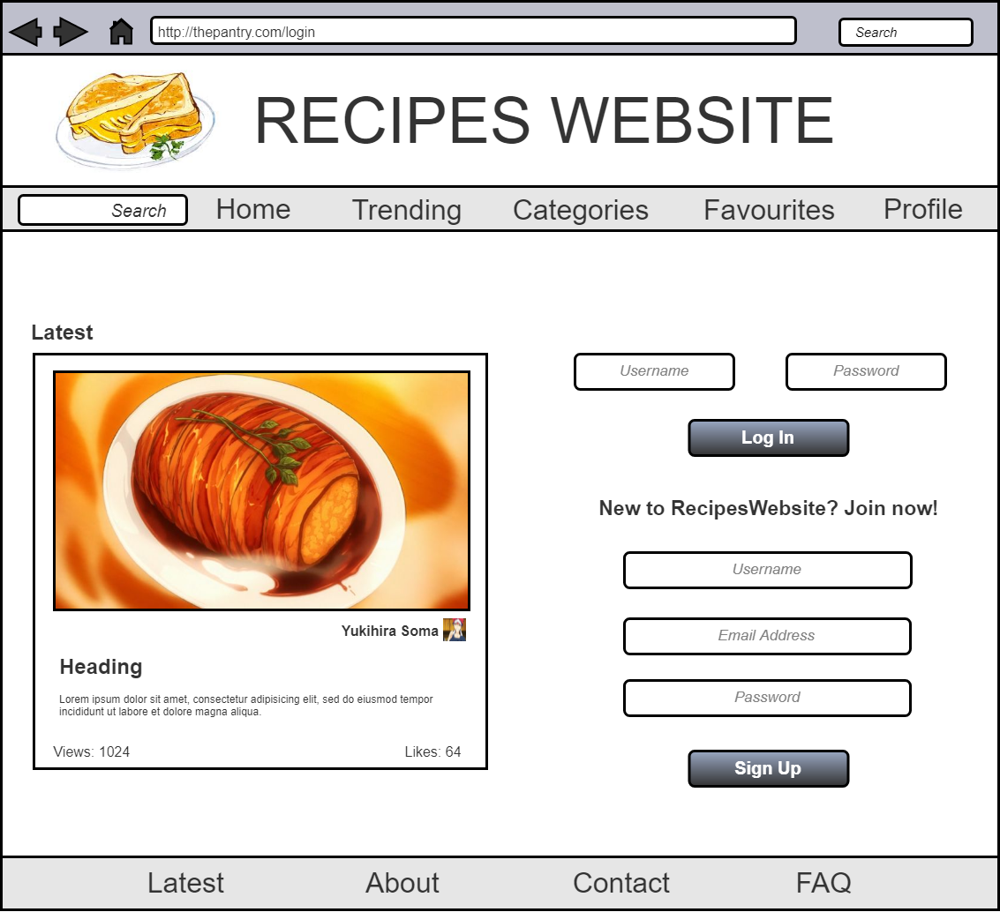
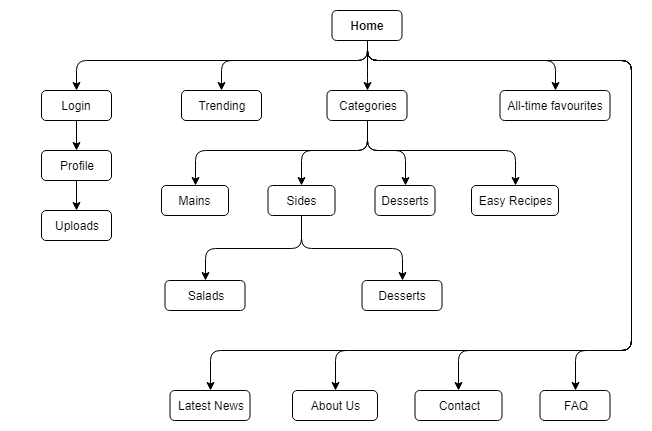

\tableofcontents

\newpage
#1 Application Overview
We have decided to create a platform for people to share all things cooking. This will be a recipe website with an emphasis on shairng specific information, by encouraging people to post photos, recipes and share ideas. Our team has decided to create a platform to allow users access to recipes, as well as post their own recipes with any type of media: videos, images, etc. Futhermore other than sharing their own recipes, we will allow users to follow different content creators and provide a feed of personalised recipes, based on previous recipes that the user has viewed or by different creators they have followed.

#2 Specification
##2.1 Functionality
1. Users sign up and manage their account: profile, posts, feed, etc.  
2. Search box to search for recipes and other users.  
3. Allow users to post in structured manner: a section for image, section for method and a section for ingredients.  
4. Allow users to browse through different catagories and content creators via menus and submenus.

##2.2 Assumptions and Dependencies
We are assuming that users will want to post recipes in a structured format, that is: uploading a picture of the finished product; entering key details such as the ingredients list; method taken to reproduce recipe and how many people it serves.

##2.3 Developments Methods
We will use a version control system to collabrate, the specific tools being git and github. To implement the project we will be using Python with the Django framework as well as several different other programming languages and tools such as photoshop for site graphics.

\newpage
#3 User Personas
##3.1 Persona 1
\
\newpage

##3.2 Persona 2
\

##3.3 Persona 3
\

\newpage
#4 System Architecture 

\newpage
#5 Entity Relationship Diagram
\ \newpage

#6 Wireframes
##6.1 Index Page
\ \newpage

##6.2 Recipe Page
\ \newpage

##6.3 Category Page
\ \newpage

##6.4 Login Page
\ \newpage

#7 Site Walkthrough 

##7.1 General Layout
When one first loads up the website, one will be presented with a menu bar at the top with the options: Home, Treding, Categories, Favourites and Profile. Clicking on any of these will take you to the respective pages. At the top right hand corner of the website one will find a login/out button which can be used once one has a registered account. To the left hand corner of the top menu, there is a search bar that users can use. Furthermore, users are presented with a feed of recipes in the center of the page. When transitioning from page to page, the main section of the website may change content to fuffil said pages requirements. Finally There is a menu at the foot of the website with a link to the latest recipe posts and several support links. Each page has the same general layout to provide an easy to use website and contiunity. Provided below is a visual mapping of how to navigate the website:
\ \newpage

##7.2 How-To Tutorial

###7.2.1 Index Page
To navigate users need to click on links in the respective menus to take oneself to another page. If users want to find a specific recipe or user, one simply needs to type what they are looking for in the search bar. If not signed in one will be presented with a feed of trending recipes, however if signed in the feed is personalised based on which users one follows and on previous recipe viewing history.

###7.2.2 Catagory Page
On this page the feed is replaced by captioned images of the catagories available on the website, to go to the respective catagories the user simply needs to click the image for the catagory.

###7.2.3 Recipe Page
When the user has clicked on the recipe, the user will be presented with the method and ingredients. The ingredient list is always below the image of the finished product and is listed by name and amount. The method is always to the right, users should follow the steps provided to make the following recipe. At the bottom users can leave comments for the recipe author, comments are seen by all users.

###7.2.4 Login Page
If the user is already registered with the website then one can login by entering one's username and password and pressing the log in button. Once logged in users have the option to modify their profile and post a recipe. If the user is not registered with the website then one can register by choosing a available username and password and providing an email account that blongs to oneself.

