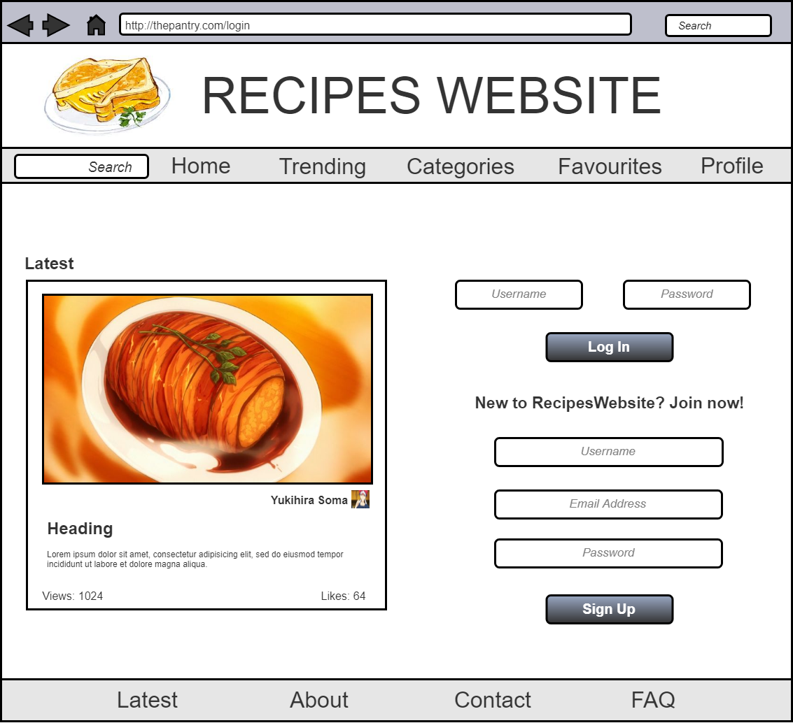
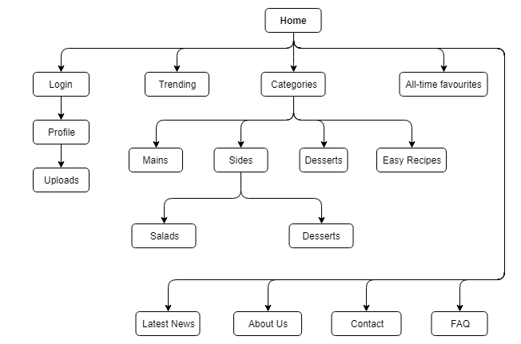

\tableofcontents

\newpage
#1 Application Overview
We have decided to create a platform for people to share all things cooking. This will be a recipe website with an emphasis on shairng specific information, by encouraging people to post photos, recipes and share ideas. Our team has decided to create a platform to allow users access to recipes, as well as post their own recipes with any type of media: videos, images, etc. Futhermore other than sharing their own recipes, we will allow users to follow different content creators and provide a feed of personalised recipes, based on previous recipes that the user has viewed or by different creators they have followed.

#2 Specification
##2.1 Functionality
1. Users sign up and manage their account: profile, posts, feed, etc.  
2. Search box to search for recipes and other users.  
3. Allow users to post in structured manner: a section for image, section for method and a section for ingredients.  
4. Allow users to browse through different catagories and content creators via menus and submenus.

##2.2 Assumptions and Dependencies
We are assuming that users will want to post recipes in a structured format, that is: uploading a picture of the finished product; entering key details such as the ingredients list; method taken to reproduce recipe and how many people it serves.

##2.3 Developments Methods
We will use a version control system to collabrate, the specific tools being git and github. To implement the project we will be using Python with the Django framework as well as several different other programming languages and tools such as photoshop for site graphics.

\newpage
#3 User Personas
##Persona 1
\
\newpage

##Persona 2
\

##Persona 3
\

\newpage
#4 System Architecture 

\newpage
#5 Entity Relationship Diagram
\
\newpage

#6 Wireframes
\
\newpage

#7 Site Walkthrough 
\

##7.1 Description

###7.1.1 Main Page Descriptions

####7.1.1.1 Home Page 
The inital page users will see is a home page. This will have a feed with latest post displayed, a log in and sign up section. Along the top of the page there will be various links to different areas of the website with a parallel line of links at the bottom of the page. These links at the bottom will be mainly for support with a "Contact", "FAQ", "About Us" and "Latest News".

####7.1.1.2 Categories 
This page will display all the different types of dishes for example, Mains, Sides, Desserts and Easy Recipes that are stored on the website as links. These links take the user to the appropriate page where related posts will be displayed.

####7.1.1.3 Profile 
This page will contain the signed in users information that he/she has agreed to share with the websites community. It will have a profile picture and all of the posts that this users has created. It will also contain a section where the user can upload data in the form of posts.

